  

<h1 align="center">Jonas Atelier</h1>

  Drivers for the parts robots are actually built from — motors and encoders,
  sensing, power, buses. Plain C99, no dependencies, no allocation, and no
  build system to adopt: copy two files in and go.

  Every register value is traced to a line in the datasheet, and the comment
  next to it says which one. Where a vendor does not publish a register map,
  the README says so rather than pretending otherwise.

  ✅ Available · 🧪 Hardware validation · 🚧 On-going

<pre>
├── ⚡ ESP32 / ESP-IDF
│   ├── esp-c620-control      — RoboMaster M3508 / C620 motor control  🧪
│   ├── esp-bmi088-imu        — BMI088 accelerometer + gyroscope       🧪
│   ├── esp-as5600-encoder    — AS5600 magnetic rotary encoder         🚧
│   ├── esp-ina2xx-sensor     — INA219/226/228 power monitors          🧪
│   ├── esp-mcp23-expander    — MCP23017 I/O expander                  🚧
│   ├── esp-ps-controller     — DualShock 4 / DualSense over BT        🧪
│   ├── esp-dw1000-uwb        — DW1000 UWB two-way ranging             🧪
│   └── esp-sn65hvd230-can    — Classic CAN over TWAI                  ✅  <a href="https://github.com/JonasAtelier/esp-sn65hvd230-can">🔗</a>
│
├── 🐧 Linux
│   ├── nv-ps-controller      — PS4 / PS5 pads on NVIDIA Jetson        🚧
│   └── Robust                — ROS 2's model, in plain C, one device  🚧
│
└── 🧰 General
    ├── upid                  — Portable PID control                   ✅  <a href="https://github.com/JonasAtelier/upid">🔗</a>
    ├── fsm                   — Table-driven finite state machines     🧪
    ├── kin                   — Forward / inverse kinematics           🧪
    ├── imp                   — Impedance &amp; admittance control         🧪
    ├── f_kalman              — Scalar Kalman filter                   🧪
    ├── f_complementary       — Complementary filter                   🧪
    └── f_particle            — Particle filter                        🧪
</pre>

  

  Everything here is plain C99 — one header, one source file, copy them in.
   
  Projects become clickable after hardware validation and public release.

  <a href="https://github.com/JonasAtelier/jonas-atelier-libraries"><b>Full catalog, including what is coming →</b></a>

